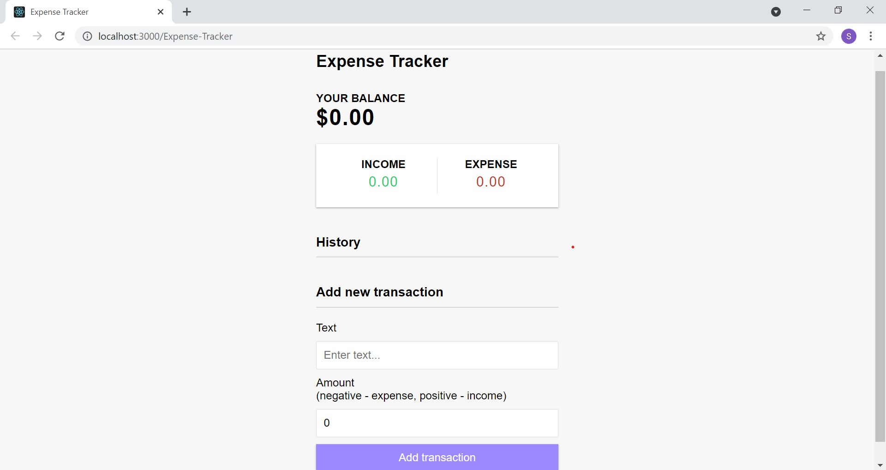

# Expense-Tracker

Simple expense tracker built with MERN stack

### How to run

 npm install
 
 cd client npm install
 cd ..
 
 ### Run front and backend
 npm run dev
 
 ### Backend only
 npm run server
 
 ### Frontend only
 npm run client
 
 ### Build client
 cd client
 npm run build
 
 ## Preview
 
 
 

https://user-images.githubusercontent.com/69248457/130378599-b1ba6899-d0c2-44eb-9833-ed4aac528a45.mp4

